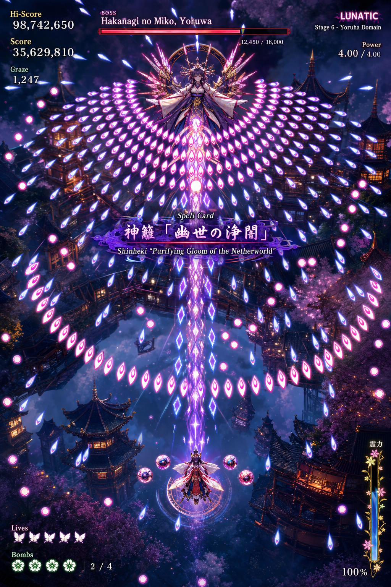

# Elixir Web弾幕シューティング デザイン仕様書

## 目的

この文書は、現在の画面イメージに忠実なビジュアル仕様を定義する。
ゲーム性は2Dだが、見た目は幻想的で奥行きのある `2.5D` 弾幕シューティングとして表現する。

基準イメージ:

関連文書:

- [PLAN.md](PLAN.md)
- [ARCHITECTURE.md](ARCHITECTURE.md)
- [GAME_SPEC.md](GAME_SPEC.md)

## デザインの核

- 密度の高い弾幕を、恐怖ではなく美しさとして見せる
- 暗い夜景の上に、紫、桃、青白の発光を強く浮かび上がらせる
- ボスを神秘的で荘厳な存在として中央上部に置く
- プレイヤーは小さく、孤独で、弾幕の海に挑む存在として見せる
- 3D背景は豪華にするが、常に弾と自機の視認性を優先する

## 画面全体の構図

### レイアウト

- 画面は縦長を前提にする
- ボスは画面上部中央
- 自機は画面下部中央
- 弾幕はボスから扇状かつ同心円状に広がる
- 画面中央にはスペルカード名演出が一時的に重なる

### 視線誘導

- 最初にボスのシルエットと翼状の弾幕が目に入る
- 次に中央を貫く主弾列へ視線が落ちる
- 最後に下部の自機位置と回避空間を認識できる構成にする

## 色彩設計

### 主色

- 深い藍
- 夜の紫
- 赤みのある桃色
- 冷たい青白

### 補助色

- 金
- 薄い紅
- 桜色
- 黒に近い群青

### 色の使い分け

- 背景は暗い藍と紫を主体にする
- 弾は `桃色の核 + 青白い縁光` を基本にする
- ボスUIは赤紫と深紅寄りで強く見せる
- 自機まわりは紫白の保護光で目立たせる
- ライフやボムなど補助UIは白や緑で分離する

## 背景デザイン

### 世界観

- 幻想的な和風建築が空中や高低差のある空間に浮かぶ
- 夜景、灯り、霧、桜、塔、屋根の重なりで立体感を作る
- 現実寄りではなく、夢幻的で超常的な空間にする

### 背景の見せ方

- 背景はディテール豊富でよい
- ただし輪郭は少し柔らかく、軽くボケてもよい
- プレイ領域中央は比較的抜けを作る
- 高コントラストを弾とボスに譲る

## ボスデザイン

### 配置

- 画面上部中央に固定感のある位置で見せる
- 視覚的には祭壇、後光、輪、翼、飾りフレームで神格化する

### 印象

- 神秘的
- 荘厳
- 危険だが美しい
- 支配的

### シルエット

- 人型を中心にする
- 横方向へ広がる装飾を持たせる
- 背後に円環や放射装飾を置く
- 弾幕の起点として自然に見える形にする

## 自機デザイン

### 配置とサイズ感

- 画面下部中央
- ボスに対してかなり小さく見せる
- 弾幕の密度に埋もれない程度に発光輪郭を持たせる

### 演出

- 足元に魔法陣または円形の発光リングを置く
- 周囲に小型の支援球体やオプションを配置してよい
- 低速移動時は当たり判定が把握しやすくなる表現を許容する

## 弾幕デザイン

### 全体方針

- 弾は危険物である前に、美しいパターンとして成立させる
- 同一画面内で複数種類の弾を混在させる
- 主要弾列、補助弾列、装飾的な流れの役割を分ける

### 主力弾

- 涙滴型または炎滴型の弾
- 発光中心は桃色
- 外縁は青白く光る
- 密集時に羽や花びらのように見える並びを作る

### 補助弾

- 小型の丸弾を外周や隙間に置く
- 桃色の丸弾を点列として使う
- 直線圧よりもリズム感を出す用途で使う

### 中央弾列

- ボスから自機方向へ縦に貫く強い主軸を置く
- 菱形や結晶状の発光弾を重ねて、儀式的な印象にする

### 配置の特徴

- 扇状に広がる
- 左右対称性を強く持つ
- 円弧や花弁のような並びを作る
- 外周にゆるい曲線を残し、完全な直線一辺倒にしない

## UIデザイン

### 左上

- `Hi-Score`
- `Score`
- `Graze`

表示方針:

- 白からやや金寄りの明色
- セリフ体寄りで格調高く見せる
- 数字は大きく、ラベルは少し小さくする

### 上中央

- `BOSS` ラベル
- ボス名
- 横長HPバー
- 現在HPと最大HPの数値

表示方針:

- HPバーは赤から赤紫系
- フレームに装飾性を持たせる
- ボス名は気品のある書体で表示する

### 右上

- 難易度表示
- ステージ名
- `Power`

表示方針:

- 難易度は強く目立つ装飾文字
- ステージ名は副次情報として少し控えめ
- 右上ブロックは上品に縦配置する

### 下中央

- スペルカード名演出

表示方針:

- 日本語名を主
- 英語副題を従
- 紫の煙、札、霊的な帯、紋様で囲う
- 一時的に派手でもよいが、自機を完全に隠しすぎない

### 左下

- `Lives`
- `Bombs`

表示方針:

- ライフは蝶や羽のような意匠
- ボムは花紋や霊力紋のような意匠
- 補助UIとして読みやすく、主張しすぎない

### 右下

- 縦長の霊力ゲージまたは集中ゲージ
- 百分率表示

表示方針:

- 花と枝のような装飾フレーム
- 他UIよりも細長く、縦方向に存在感を出す

## タイポグラフィ

### 方針

- 無機質なUIにはしない
- 幻想的、儀式的、格調高い印象を優先する
- ただし数字は一目で読める必要がある

### 使い分け

- 数値: 読みやすい高コントラスト書体
- 見出し: セリフ体または装飾性のある高級感のある書体
- スペルカード名: 最も装飾的でよい

## 光とエフェクト

### 必須表現

- 弾の強いグロー
- ボス背後の後光や円環
- 背景の灯り
- 霧と空気遠近
- 自機足元の魔法陣発光

### 制約

- グローを強くしすぎて当たり判定が見えなくならない
- 被弾時以外は画面全体の白飛びを避ける
- 背景エフェクトは常にプレイ可読性より下に置く

## カメラ仕様

- やや俯瞰
- 僅かに傾けて奥行きを出す
- 通常時は安定
- 演出時もプレイ領域の上下関係が崩れない

## 3D表現の使い方

- 背景建築の高低差
- 光源の層
- 霧の重なり
- 弾の前後感
- ボス背後装飾の立体感

ただし、プレイルールは必ず2Dの読みやすさを維持する。

## 絶対に守ること

- 自機は常に見失いにくい
- 弾は美しいが、危険領域が読める
- UIは豪華でもプレイを邪魔しない
- 背景は濃密でも中央の可読性を壊さない
- 3D演出で弾道認識を壊さない

## 避けること

- 近未来SF寄りの無機質デザイン
- 原色だらけの雑多な配色
- 平坦すぎる背景
- UIのモダンアプリ風ミニマル化
- カメラの過剰な揺れ
- 弾と背景の明度が近すぎる状態
